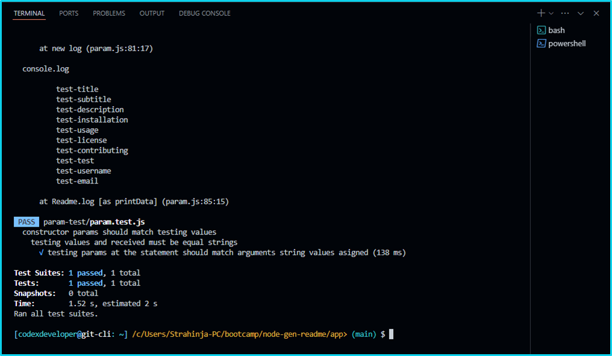
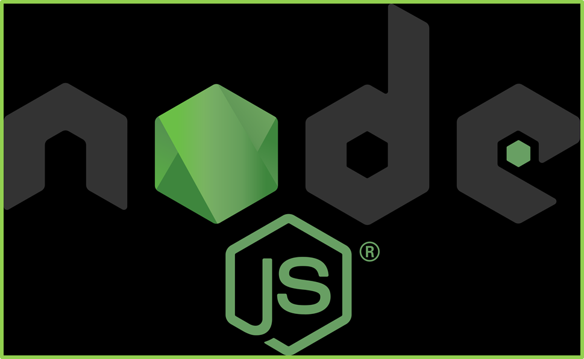

# node-gen-readme

## Node.js Generator README.md      

[](https://opensource.org/licenses/MIT) 

<p align="left">
    
    
    
    
    
<p align="left">
    <a href="https://gist.github.com/Julien-Marcou/156b19aea4704e1d2f48adafc6e2acbf"></a>
    <a href="https://nodejs.org/en"></a>
    <a href="https://docs.npmjs.com/about-npm#getting-started"></a>
    <a href="https://www.npmjs.com/package/inquirer"></a>
    <a href="https://www.npmjs.com/package/json5"></a>
    <a href="https://www.npmjs.com/package/jest?activeTab=readme"></a>
</p>

<p align="left">
    <a href="https://twitter.com/stanpopovic"></a>
    <a href="https://www.youtube.com/@strahinja-popovic-ch"></a>
</p>

## Generator README.md file with `node.js v22.0.0`, `npm-v10.5.2`, `nvm-v0.39.7 (optional)` and `inquirer-v8.2.4`

<a id="table-of-content"></a>
## Table of Content (TOC)

- [Table of Content](#table-of-content)
- [Description Info](#description-info)
- [GitHub Repository](#github-repository)
- [Installation Process](#installation-process)
- [Usage Info](#usage-info)
- [Contributing Guidelines](#contributing-guidelines)
- [Test Instructions](#test-instructions)
- [Demonstration on YouTube](#demonstration-on-youtube)
- [License](#license)
- [Questions and Contacts](#questions-and-contacts)

<a id="description-info"></a>
## Description Info

Application `node-gen-readme` or Node Generator README application provides a comperhensive README.md file as a resulting output and help developers to create such file more quickly then before. It is developed by using `node.js v22.0.0` JavaScript runtime environment, `Node Package Manager npm-v10.5.2` public registry and `inquirer-v8.2.4` question-answer handler. Application can be invoked from `~/app>` directory by using bash terminal command `$ node index.js`.

<a id="github-repository"></a>
## GitHub Repository 
[](https://github.com/strahinjapopovic/node-gen-readme)

## Git Bash Terminal setting up origin main
[](./app/screenshots/gitbash-operational-state-dir.PNG)

<a id="installation-process"></a>
## Installation Process
### Node.js®-JavaScript runtime environment `node.js-v22.0.0`, Node Package Manager `npm-v10.5.2` and Inquirer `inquirer-v8.2.4`. Then run following commands.

## Prebuild Installer Node.js® installation
Download Node.js version v20.12.2, v21.7.3 or v22.0.0 from [Node.js®-v22.0.0 ](https://nodejs.org/en) official website and install at your local machine with Prebuilt Installer. It will include npm (v10.5.0) or npm (v10.5.1) depends on node.js version instolled. Then run those commands below. I use Git-Bash terminal and my default approximate `PS1` or `$PS1` (Prompt String 1) variable looks like `[user@host: ~] /c/Users/user/dev/node-gen-readme/app> (main) $`, so left dollar sign out of any coppied code that has to be runned, if any.

```bash
npm init -y
npm install inquirer@8.2.4
node index.js # after installation application is invoked by this line
```
Alternativelly, you can run git, curl or wget installation process on CLI terminal (Linux based CLI) to install Node Version Manager (nvm-v0.39.7) at first. After installing NVM you can install Node.js version at your choice, the latest one is v22.0.0. Node.js instalation process will install Node Package Manager (npm) by default npm-v10.5.0 or npm-v10.5.1 depends on node version installed. Last part is to install inquirer-v8.2.4 or any other inquirer-version lower then inquirer-v9. If you wish to install inquirer version v9 or higher then you will have to make some changes in the package.jason file and init some auto load processes since version higher of v9 are based on esm an advanced ECMAScript module loader. For information about inqirer, esm and versions available, reffer to [inquirer](https://www.npmjs.com/package/inquirer) and [esm](https://www.npmjs.com/package/esm) official website.

## CURL Install Node.js®
Below is installation command that should instoller run using curl:
```bash
# installs nvm (Node Version Manager v0.39.7)
curl -o- https://raw.githubusercontent.com/nvm-sh/nvm/v0.39.7/install.sh | bash
```

If after running the curl command above, those lines under the section : << COMMENT apear, run lines blelow it.
```bash
: <<COMMENT
---
=> Profile not found. Tried ~/.bashrc, ~/.bash_profile, ~/.zprofile, ~/.zshrc, and ~/.profile.
=> Create one of them and run this script again
   OR
=> Append the following lines to the correct file yourself:
---
COMMENT
```
```bash
# this lines run manualy if curl do not activate Node Version Manager (nvm). You do not have to restart your terminal after this.
export NVM_DIR="$([ -z "${XDG_CONFIG_HOME-}" ] && printf %s "${HOME}/.nvm" || printf %s "${XDG_CONFIG_HOME}/nvm")"
[ -s "$NVM_DIR/nvm.sh" ] && \. "$NVM_DIR/nvm.sh" # This loads nvm
```
Then try to install node.js v22.0.0, v20.12.2, v21.7.3
```bash
# download and install Node.js v22.0.0 with nvm
nvm install 22 
# Now using node v22.0.0 (npm v10.5.1)

# check Node.js version
node -v 
# v22.0.0

# check npm version
npm -v 
# 10.5.1

# check nvm version
nvm -v 
# 0.39.7
```
OR any other version that you want.
```bash
nvm use 16
# Now using node v16.9.1 (npm v7.21.1)

node -v
# v16.9.1

nvm use 14
# Now using node v14.18.0 (npm v6.14.15)

node -v
# v14.18.0

nvm install 12
# Now using node v12.22.6 (npm v6.14.5)

node -v
# v12.22.6
```
## Git Install Node.js®
If you using GitBash terminal, navigate to your root folder and execute following line:
```bash
cd ~/
git clone https://github.com/nvm-sh/nvm.git .nvm
cd ~/.nvm
git checkout v0.39.7
# HEAD is now at bab86d5 v0.39.7
. ./nvm.sh # this activate and source nvm by executing nvm.sh shell script inside .nvm directory
```
Now add these lines below the end of your ~/git/ect/bash.bashrc file to have it automatically sourced upon login.
```bash
export NVM_DIR="$HOME/.nvm"
[ -s "$NVM_DIR/nvm.sh" ] && \. "$NVM_DIR/nvm.sh"  # This loads nvm
[ -s "$NVM_DIR/bash_completion" ] && \. "$NVM_DIR/bash_completion"  # This loads nvm bash_completion
```
For more information about nvm and installation process reffer to [GitHub nvm repo](https://github.com/nvm-sh/nvm?tab=readme-ov-file#profile_snippet).

<a id="usage-info"></a>
## Usage Info

It is used for generating professional README file by using Inquirer and NPM utilities under Node.js runtime environment.

<a id="contributing-guidelines"></a>
## Contributing Guidelines

Currentlly, at this stage there is no contributors but for more information any enquiry can be reffered to Question and Contact section.

<a id="test-instructions"></a>
## Test Instructions

Application runs by invoking command `$ node index.js` at `~/node-gen-readme/app>` directory. Before running application, download compressed repo from githaub and installl packages globaly or at application root directory from the section [Installation Process](#installation-process). 

### Testing app with Jest
Install Jest by using npm as follows:
```bash
npm install --save-dev jest
```
OR
```bash
npm i -D jest
```
Search for package.json file and inside alter following line:
```javascript
{
  "scripts": {
    "test": "jest"
  }
}
```
Finally, navigate your terminal to the `~/app>` directory and run
```bash
npm run test
``` 
Command npm run test will use `~/app/param.js` file in which we have a class and constructor parameters and processing file `~/app/param-test/param-test.js` which is testing our class, constructor, parameters and functions. Output are as follows:

### Test PASSED
[](./app/screenshots/gitbash-jest-test-output-passed-ii.PNG)

<a id="demonstration-on-youtube"></a>
## Demonstration on <a href="https://youtu.be/y8kfGvOxd2I" style="background-color: white; color: darkRed; font-weight: bold; border-radius: 5px; text-decoration: none;">&nbsp;YouTube&nbsp;</a>

Demonstration of the application can be visited at [](https://youtu.be/y8kfGvOxd2I).

## License

Copyright © 2024, [codeXdeveloper](https://github.com/strahinjapopovic). Released under the [MIT License](./LICENSE).

<a id="questions-and-contacts"></a>
## Questions and Contacts

Questions about application can be reffered to the author's [GitHub account](https://github.com/strahinjapopovic) or you can [Contact Me](mailto:spope.mails@gmail.com) directly over an email.
