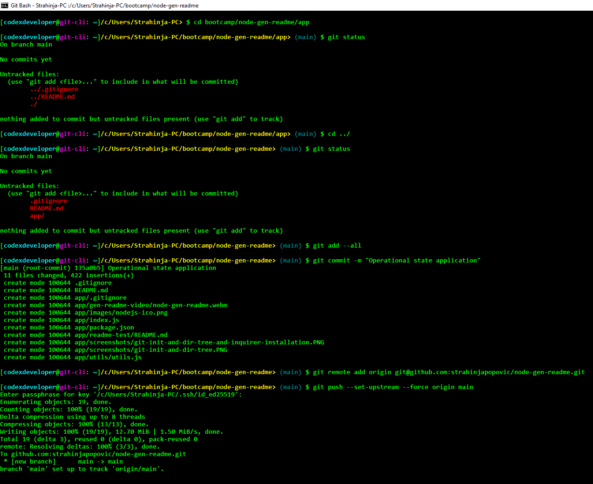

# Node.js Generator README

# [](https://opensource.org/licenses/MIT)

<p align="left">
    
    
    
    
    <a href="https://twitter.com/stanpopovic"></a>
    <a href="https://www.youtube.com/@strahinja-popovic-ch">
    
    </a>
</p>
  
<p align="left">
    
    
    
    
</p>

## Generator README.md file with `Node.js v20.12.2`, `npm-v10.5.2` and `Inquirer-v8.2.4`

## Table of Content (TOC)

- [Node.js Generator README](#title)
- [TOC](#table)
- [Description](#description)
- [Repository](#repository)
- [Installation](#installation)
- [Usage](#usage)
- [License](#license)
- [Contributing](#contributing)
- [Tests](#tests)
- [Demonstration](#demonstration)
- [Questions](#questions)

## Description

Application `node-readme-gen` or Node Generator README application provides a comperhensive README.md file as a resulting output and help developers to create such file more quickly then before. It is developed by using `Node.js v20.12.2` as JavaScript runtime environment, `Node Package Manager npm-v10.5.2` an public registry or library interface and `Inquirer v8.2.4` an question-answer handler. Application can be invoked from `~/app>` directory by using bash terminal command `> $ node index.js`.

## Repository

### Git Bash Terminal setting up remote origin
[](./app/screenshots/git-bash-operational-state-dir.PNG)

## Installation

```bash
# ---
# Install:  Node.js runtime environment v20.12.2, Node Package Manager npm-v10.5.2 and Inquirer v8.2.4. Then run following commands.
# ---
$ npm init -y
$ npm install inquirer@8.2.4
$ node index.js # after installation application is invoked by this command from Git Bash terminal
```

## Usage

It is used for generating professional README file by using Inquirer and NPM utilities under Node.js runtime environment.

## License

Application is developrd under `MIT License`. Please refer to the `MIT License` in the repo [LICENSE](./LICENSE).

## Contributing

Contributors reffer to Question and contact section.

## Tests

Tests are performed by invoking `>_ $ node index.js` commands but before it should be installed packages under section Installation.

## Demonstration

Demonstration of the application can be visited at [](https://youtu.be/y8kfGvOxd2I)

## Questions

Questions about application can be reffered to author's [GitHub Account](https://github.com/strahinjapopovic) or you can contact me directly [Contact Me](mailto:spope.mails@gmail.com).
